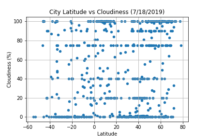
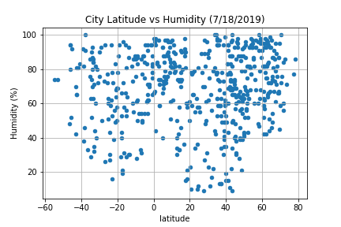
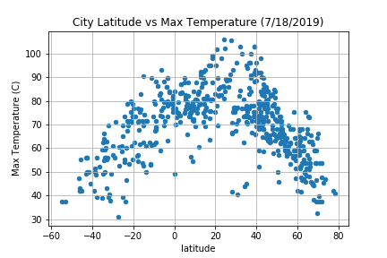
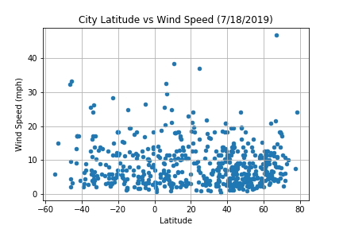

# Weather Visualization Dashboard - Latitude Analysis Dashboard with Attitude

## Background
This module attempts to answer the question: "What's the weather like as we approach the equator?" 
by creating a Python script to visualize the weather of 500+ cities across the world of varying distance from the equator. 

## Approach
This module randomly selects over 500 unique cities based on latitude and longitude using citipy 
and then performs a weather check on each of the cities using a series of successive API calls to 
[OpenWeatherMap API](https://openweathermap.org/api).

A print log of each city is created as it's being processed with the record number and city name.
A series of scatter plots are created showing the following relationships:
Temperature (F) vs. Latitude
Humidity (%) vs. Latitude
Cloudiness (%) vs. Latitude
Wind Speed (mph) vs. Latitude

## Findings:
From the graph of latitude versus cloudiness, there appears to be significant clustering around 100% cloudiness in the 0-20 latitude range indicating mostly cloudy conditions and clustering around 0% in the 20-40 latitude range indicating mostly clear conditions. 

From the graph of latitude versus huidity, it appears that the majority of latitudes have 40% or higher rates of humidity, except for the 20-40 latitude range.

There does appear to be a relationship between latitude and max temperature. While temperatures generally got higher as they approached the equator, the highest temperatures were between 20-40 degrees latitude. This is most likely due to the data being generated in July which is summer in the northern hemisphere. 

From the previous visualizations we can see that the 20-40 latitude range appears to be hotter, less humid, and have clear skies.
This could be due to 75% of the land mass between the 20th and 40th parallels being desert.

There does not appear to be a relationship between latitude and wind speed, although it is worth noting the large number of data points in the 40-60 latitude range.  This range includes a larger concentration of cities, including all of Europe.

## Dashboard
In building the web dashboard, I created individual pages for each plot of latitude versus temperature, cloudiness, humidity, and wind speed and a means to navigate between them. These pages contain the visualizations and their corresponding explanations. There is also a landing page, a page where we can see a comparison of all of the plots, and another page where we can view the data used to build them.

The website consists of 7 pages total, including:

- A landing page containing:
  - An explanation of the project.
  - Links to each visualizations page.
- Four visualization pages, each with:
  - A descriptive title and heading tag.
  - The plot/visualization itself for the selected comparison.
  - A paragraph describing the plot and its significance.
- A "Comparisons" page that:
  - Contains all of the visualizations on the same page to compare them visually.
  - Uses a bootstrap grid for the visualizations.
- A "Data" page that:
  - Displays a responsive table containing the data used in the visualizations.
